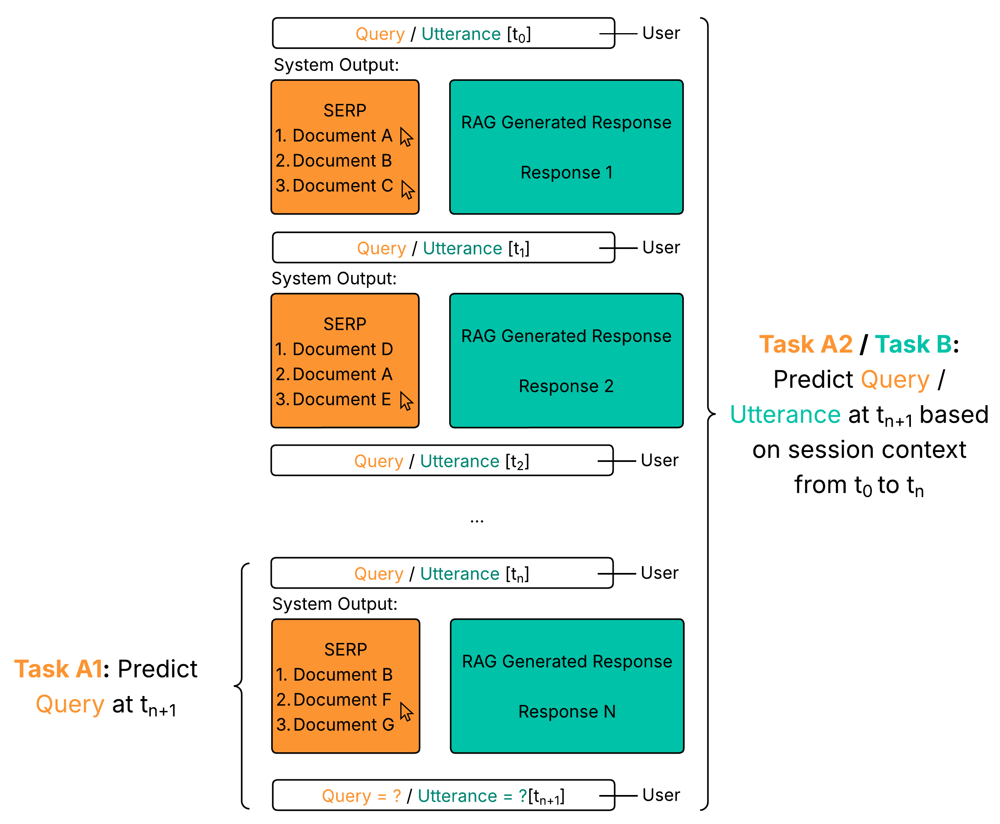

# Container Setup for Sim4IA - Micro Shared Task
Micro Shared Task for the Sim4IA Workshop at SIGIR 2025 - Data and SimIIR Framework will be available here on 16 May (AoE). 

This prototype is build upon the implementation of the [SimIIR3 Framework](https://github.com/simint-ai/simiir-3). To facilitate experimentation with this setup, please follow the installation guide below. For easy installation, a Docker setup is used.





# Submission Guideline

We ask all participants of the shared task to submit the following
- run files containing their generated queries
- a lab note that contains a short summary of the approach and some outlooks
- a link to code and data (optional)

### Run files
Please submit all your run files, regardless of the task, in the following JSON format:

```json
{
  "meta": {
    "team_name": "",
    "approach_description": "",
    "task": "",
    "run_name": ""
  },
  "1": [
    "Q1", "Q2", "Q3", "Q4", "Q5", "Q6", "Q7", "Q8", "Q9", "Q10"
  ],
  "2": [
    "Q1", "Q2", "Q3", "Q4", "Q5", "Q6", "Q7", "Q8", "Q9", "Q10"
  ],
  "...": [
    "Q1", "Q2", "Q3", "Q4", "Q5", "Q6", "Q7", "Q8", "Q9", "Q10"
  ],
  "45": [
    "Q1", "Q2", "Q3", "Q4", "Q5", "Q6", "Q7", "Q8", "Q9", "Q10"
  ]
}
```
Each key represents a topic ID. The corresponding list contains 10 candidate queries, sorted in **descending order by their estimated probability of success** (i.e., the most promising query comes first). Each run must be submitted as a separate file for each task (A1, A2, B). While there is no strict naming convention for the submitted run files, please ensure that the meta field in each respective JSON run file is properly filled out.
- **team_name**: Can be freely chosen.
- **approach_description**: Provide a brief summary of the underlying approach.
- **task**: Must follow one of the following formats: Task_A1, Task_A2, or Task_B.
- **run_name**: Should be meaningful and align with the naming used in your lab notes, though it can still be chosen individually.

### Lab Notes (1 page, no formatting requirements)
Please also submit a one-page lab note that explains your approach, answering the following questions:
- **How does your approach work?** Briefly describe your pipeline, model(s), or heuristics.
- **What was the underlying idea behind your approach?** Explain your motivation and design decisions.
- **Future of Evaluation in Interactive Retrieval.** Based on your experience with this micro shared task, the report should also include your perspective on future evaluation settings in interactive retrieval.

### Submission process
Please submit your run files by **June 27**. The **lab notes** must be submitted by **July 4**. Submission will be handled via EasyChair: https://easychair.org/conferences/?conf=sim4ia-sigir2025.

If you are submitting multiple run files, please **combine them into a single** .zip archive. When submitting your run files, please **include a link to your public GitHub repository** containing the corresponding code by adding the link to the repo in the **EasyChair submission form**.

### Availability of the submissions / post-workshop proceedings
Before the workshop, we will share **lab notes internally** among all participants who submitted a run to the workshop. They will **not be published publicly**.

After the workshop, we plan to compile a dataset on **Zenodo**, which will include the submitted run files, scripts, and the provided datasets. We ask all participants to submit an extended version of their lab papers from which we will compile post-workshop proceedings, most likely to be submitted to CEUR. 

## Installation

1. Open the GitHub Repository in [Codespaces](https://github.com/features/codespaces)
2. Download the Index from Sciebo using the following command in the Codespaces terminal:
```shell
curl -L -o index_CORE.zip "https://th-koeln.sciebo.de/s/F9AEa1CXyk2RTpf/download"
```
3. Unzip the downloaded index `example_data/index_CORE.zip` file into the `example_data/index_CORE` directory using the following command in the Codespaces terminal:
```shell
unzip index_CORE.zip -d ./example_data/
```
4. Delete the downloaded file:
```shell
rm index_CORE.zip
```
5. Build the container by executing the following command in the Codespaces terminal:
```shell

COMPOSE_BAKE=true docker-compose up -d --build
```
If the container has already been built, you can start it with the following command in the Codespaces terminal:
```shell

docker-compose up -d

```
6. All dependencies should be installed automatically
7. You can access Docker shell via the following comman in the Codespaces terminal:
```shell

docker exec -it SIM4IA_container bash

```
8. At the end of the session you should shutdown the container and delete the project from your Codespaces terminal with the following command:
```shell

docker-compose down

```

## About the data 

For both Task A and Task B, predetermined queries/utterances are provided in the repository to initialize the simulation with the original user inputs.
In Task A, the dataset also includes metadata about user interactions, including timestamps for each query and subsequent actions, that you might use for your query predictions.

[Predetermined Queries for Task A](./simiir/predetermined_queries_Task_A.csv)

--- 

**🚨 NEW FINAL TEST DATA RELEASED FOR TASK A & TASK B! 🚨**  
*Please adjust your file paths accordingly to use the updated data.*

- 🔗 **[Final Test Data for Task A](./simiir/predetermined_queries_Task_A_test.csv)**
- 🔗 **[Final Test Data for Task B](./example_data/predetermined_utterances_test.json)**

##  How to do the experiments?

Detailed task descriptions for Task A and Task B are available on the [workshop website](https://sim4ia.org/sigir2025/). To run initial experiments for these tasks, follow the steps outlined below.

> A short note on the examples used in this first tutorial: Although we provide more sessions for all tasks, we only included a smaller sample in the examples due to run time and memory restrictions in GitHub Codespaces. If you run the examples in a more potent local environment, all available sessions should and could be used. 

1. Adjust your query reformulation approach 
    - You can find existing implementations in `simiir/user/query_generators/` for Task A1/A2 and `simiir/user/utterance_generators` for Task B
2. Create a new user configuration that uses your query reformulation approach
    - Existing user configurations can be found in `example_sims/users/`
3. Add your new user configuration to the experimental setup
    - The setup for Task A1/A2 is located in `example_sims/core_bm25_Sim4IA.xml`   
    - The setup for Task B is located in `example_sims/core_Sim4IA_conversational_simulation.xml` 
4. Navigate to the `simiir` directory in the terminal
5. Run the configuration file with:
```shell

python run_simiir.py ../example_sims/core_bm25_Sim4IA.xml 

```
or
```shell

python run_simiir.py ../example_sims/core_Sim4IA_conversational_simulation.xml 

```

For the Conversational Search Task, an LLM is currently required for generating utterances. To run the simulation described above, follow the steps under "How to do the experiments with LLMs in Codespaces?" to set up and execute your chosen model.
If you decide to use a different model, make sure to adapt the configuration accordingly.

6. Instructions and a pipeline for the evaluation of your approach will follow soon. 


## How to do the experiments with LLMs in Codespaces?

> A short note on the usage of LLMs in Codespace: It's slow, and the resources are limited. But it works with smaller models and with enough patience. If you plan something more advanced, we advise you to run the LLM in a more potent local environment. 

1. Check Available Disk Space.

Check how much disk space you have available in Codespaces to determine which LLM model you can install.  
👉 See available models [here](https://github.com/BlackTechX011/Ollama-in-GitHub-Codespaces)

2. Access the Docker Container.
Open a terminal in Codespaces and run:
```shell

docker exec -it SIM4IA_container bash

```
3. Start ollama with the following command in the Codespaces terminal:
```shell

ollama serve &

```
4. Install and Run the Selected Model.

Install and run the model you want to use (e.g., `gemma:2b`) with the following command in the Codespaces terminal:
```shell

ollama run gemma:2b

```
5. Exit the prompt in the terminal with Ctrl + D

6. Configure Your LLM-Based Query Generator. 
Open the file `example_sims/users/core_LLM_based_Queries.xml`. This file is used to define how the LLM generates queries.
Make sure to update the following line to specify the model you want to use:
```xml

<attribute name="model" type="string" value="gemma:2b" is_argument="true" />

```
Replace `gemma:2b` with the name of the model you installed.

7. Add your user configuration to `example_sims/core_bm25_Sim4IA_LLM_approach.xml`
8. Navigate to the `simiir` directory in the Codespaces terminal
9. Run the configuration file with the following command in the Codespaces terminal:
```shell

python run_simiir.py ../example_sims/core_bm25_Sim4IA_LLM_approach.xml 

```

## License

This project is licensed under the MIT License - see the LICENSE file for details.


